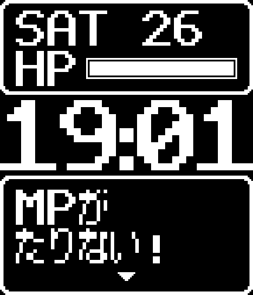

# Dot Quest

Pebble 2 Duo (flint) 向けの、レトロRPGのメッセージウィンドウ風ウォッチフェイス。



- 上: 曜日・日付と HP ゲージ(電池残量)
- 中: 時刻(ドットフォント 40px)
- 下: 冒険のひとこと。2行目と1行目をランダムに組み合わせて文章を作る。30秒ごと、または手首を振ると切り替わる

## ビルド

Pebble SDK (pebble-tool) で:

```sh
pebble build
pebble install --emulator flint
```

## フォント

`resources/fonts/PebbleDot16x20-Regular.ttf` は自作の 16x20 ドットフォント「Pebble Dot 16x20」。

- かな: 美咲ゴシック第2 (門真 なむ / Little Limit) をもとに作成 — https://littlelimit.net/misaki.htm
- 英数字・記号: このプロジェクト用のオリジナル字形

ライセンスは [resources/fonts/LICENSE.txt](resources/fonts/LICENSE.txt) を参照(使用・複製・改変・再配布自由)。

Pebble のフォント変換は1フォント256グリフまでなので、`package.json` の `characterRegex` で使う文字(英大文字・数字・記号・かな)だけに絞っている。
